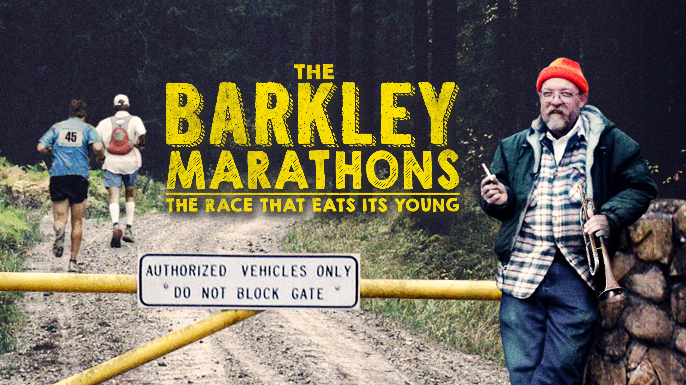
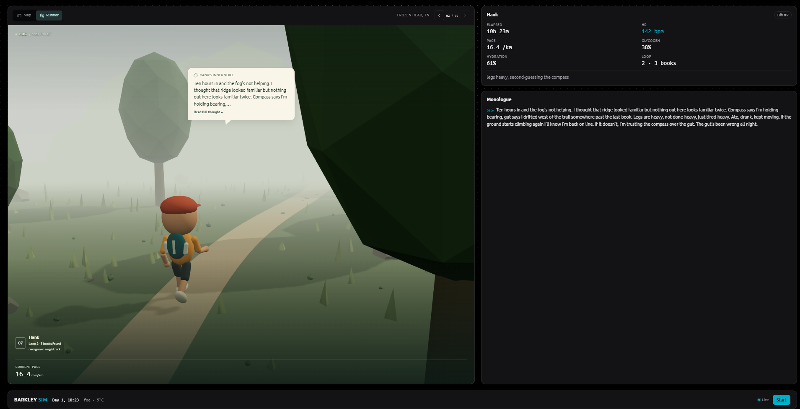

# Barkley Marathons Simulator

A simulation of an LLM (powered by Haiku) running the Barkley Marathons—one of the world's most brutal ultramarathons: 100
miles in 60 hours through unmarked terrain in Tennessee, with secret "books" hidden along each of 5 loops to prove passage.

## Motivation

One evening I went down a rabbit hole of YouTube documentaries and discovered several about the Barkley Marathons: one of the toughest ultra-marathons in the world with a 99% DNF rate.
The specifics of the course are what make it particularly difficult:

- A completely unmarked route
- No aid stations
- Over 65,000 feet of elevation
- No GPS or tracking is allowed

Somehow that led me to question: what happens when you throw an AI model into it?

I was inspired by experiments with small AI societies, where LLM-powered agents are given resources, constraints and an environment rather than being asked to solve a single prompt. The interesting behaviour comes from the feedback loop: an agent makes a decision, the world changes, and its next decision has to account for the state it helped create.

I wanted to replicate this using the brutal environment of Frozen Head State Park, Tenessee - the location of the Barkley Marathons.

Instead of asking a model to simply predict whether a runner finishes, the simulator places an agent inside a simplified race world. It has limited information, changing physical state, navigation decisions and environmental conditions. At each step, the model has to decide what to do next based on its current situation, while those decisions affect the state it encounters later.

The simulator
models the runner's body (heart rate, glycogen, hydration, core temp, sleep debt) and the harsh world (weather, fog, terrain, day/night cycle),
feeding observations to the LLM as the "brain" making decisions every few minutes (effort level, eating, drinking, bearing, resting, quitting).
