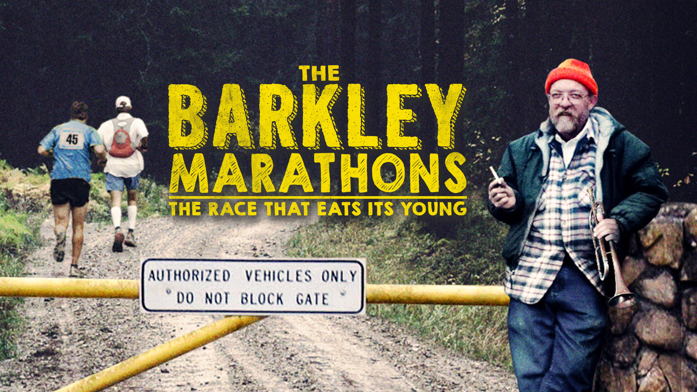
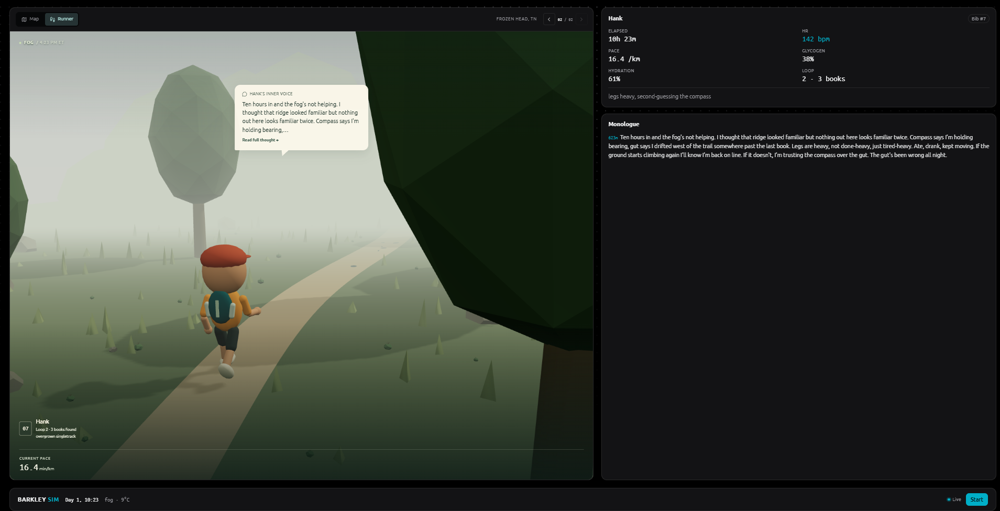

# Barkley Marathons Simulator

A simulation of an LLM (powered by Haiku) running the Barkley Marathons—one of the world's most brutal ultramarathons: 100
miles in 60 hours through unmarked terrain in Tennessee, with secret "books" hidden along each of 5 loops to prove passage.

## Motivation

One evening I went down a rabbit hole of YouTube documentaries and discovered several about the Barkley Marathons: one of the toughest ultra-marathons in the world with a 99% DNF rate.
The exact start date and time are closely guarded secrets. The race can start at any hour between midnight and noon on the opening day, which is between mid-March and early April each year.
The specifics of the course are what make it particularly difficult:

- A completely unmarked route
- No aid stations
- Over 65,000 feet of total elevation gain
- No GPS or tracking is allowed

The 60 hour countdown for the completion time limit begins when race director Gary Cantrell lights a cigarette at the start line.

Somehow learning about this race that led me to question: what happens when you throw an AI model into it?

I was inspired by experiments with small AI societies, where LLM-powered agents are given resources, constraints and an environment rather than being asked to solve a single prompt. The interesting behaviour comes from the feedback loop: an agent makes a decision, the world changes, and its next decision has to account for the state it helped create.

I wanted to replicate this using the brutal environment of Frozen Head State Park, Tenessee - the location of the Barkley Marathons.

Instead of asking a model to simply predict whether a runner finishes, the simulator places an agent inside a simplified race world. It has limited information, changing physical state, navigation decisions and environmental conditions. At each step, the model has to decide what to do next based on its current situation, while those decisions affect the state it encounters later.

The simulator
models the runner's body (heart rate, glycogen, hydration, core temp, sleep debt) and the harsh world (weather, fog, terrain, day/night cycle),
feeding observations to the LLM as the "brain" making decisions every few minutes (effort level, eating, drinking, bearing, resting, quitting).

## Key features

- **Physiology sim** — heart rate, glycogen, hydration, and core temp evolve from effort, grade, heat, and cardiac drift over elapsed time. Run glycogen to zero and pace collapses into a bonk; the runner has to eat/drink/rest its way back out.
- **True vs. believed position** — the runner never sees its real GPS location, only a noisy estimate that gets worse with fog, night, and fatigue. The frontend draws both dots and the gap between them — most of the comedy comes from the LLM trusting a compass reading that's quietly lying to it.
- **Sleep-debt hallucinations** — past ~40 hours in, the runner starts seeing things (a bear that waves back, a mirage finish line, trail markers spelling out its bib number) that get injected straight into its own observations as if real.
- **Decaying memory** — older race history isn't just summarized, it's _degraded_: as sleep debt rises, the compacted memory of earlier loops gets jumbled and less reliable, while recent turns stay sharp — the runner's own sense of "what happened earlier" erodes exactly like a real sleep-deprived brain's would.
- **Random misadventures** — trips and falls on rough grade, briar scratches, puddle steps, spooked-by-wildlife-at-night, dropped water bottles — one-off comedic events layered on top of the physiology, terrain, and time-of-day that make them likely.
- **Hidden books, real Barkley rules** — 13 books hidden per loop, must be found and "torn" (bib page noted) to prove passage; loops only count once a real fraction of the course has actually been covered, not just wandered near the start/finish.
- **Crash-safe, checkpointed runs** — every decision is checkpointed (including RNG state, for bit-exact resume) so the sim can survive a crash or restart mid-race without losing the runner's progress or memory; a supervisor auto-restarts a failed run from its last checkpoint rather than losing the whole 60 hours.
- **Live-streamed, not replayed** — a WebSocket broadcasts every tick and every brain decision as it happens, so the map, watch face, and monologue feed update in real time while the race is actually running.
- **Full observability** — every Anthropic call is traced end-to-end in Langfuse, and every Observation/Decision pair (plus any failed brain calls and why) is logged to SQLite for later digging.
